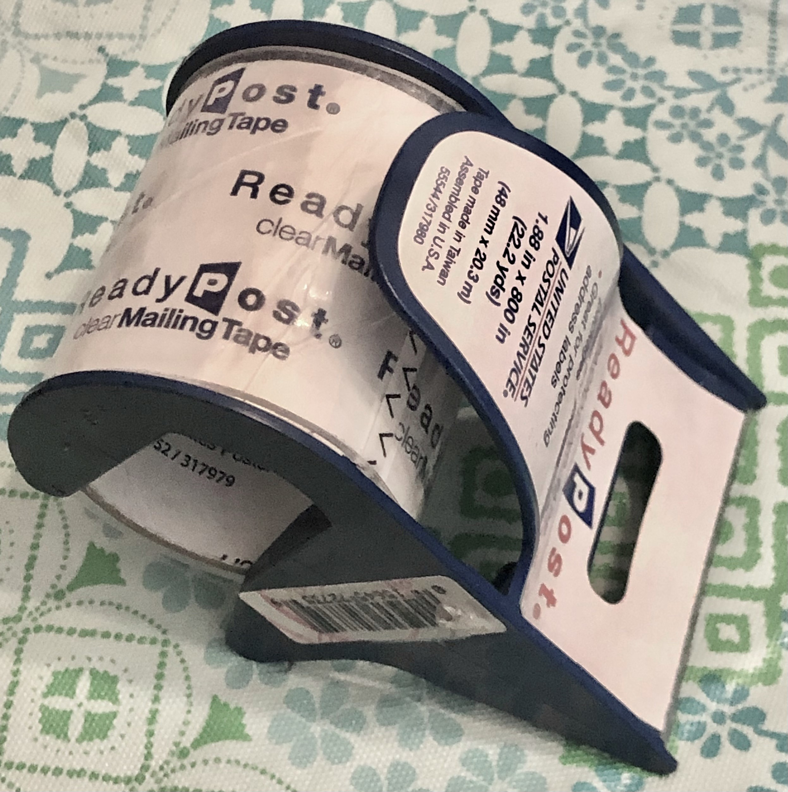
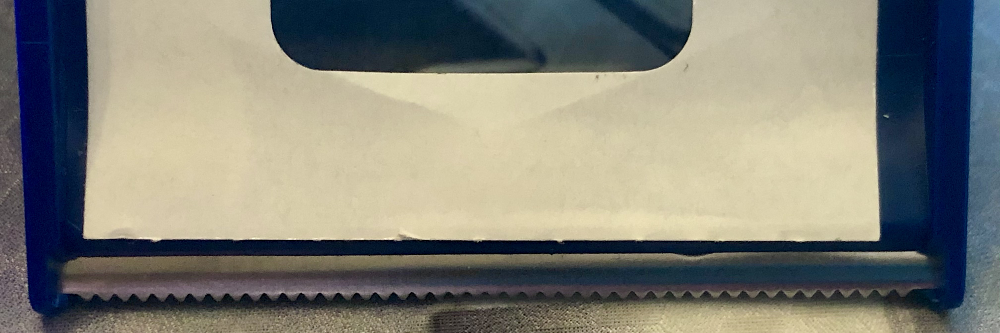
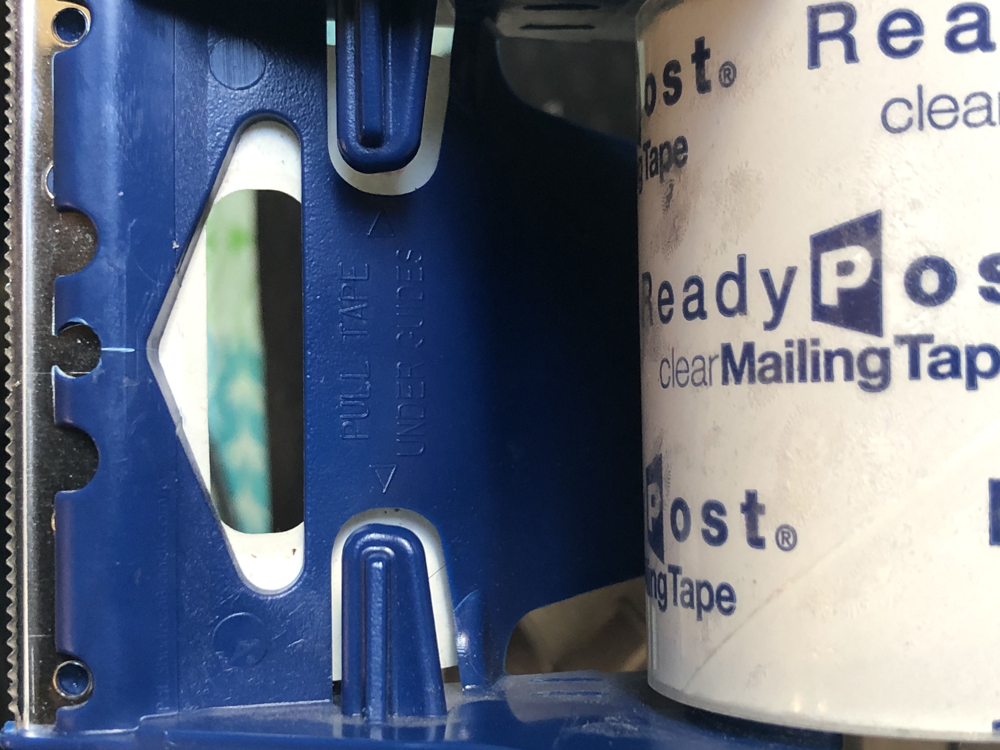
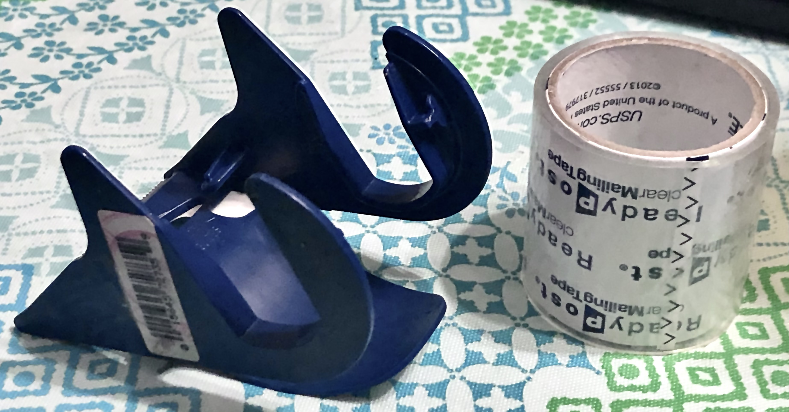

# UX Journal 2 – Packaging Tape

### Michael Spears, 4/30/21
For my second journal I will examine a packaging tape dispenser and measuring it’s **safety**, **efficiency** and **learnability**.
#### Overview
This tape dispenser is used in taping closed packages for shipping. It has a roll of thick packaging tape on a spool and serrated metal edge for cutting.  
  
  
Tape is pulled over each guide which keeps the end of the tape from sticking the roll.  

## Narrative
Yesterday, I used this tape dispenser to seal a package for shipping. I couldn’t remember that last time I had used this tool, so I had to relearn how to use it. I looked for the edge of the tape to peel it back. It was hard to find since the tape was transparent and flush to the roll. Once I started to peal the tape back, I wasn’t sure in what orientation I was supposed to cut the tape. Was I holding it upside-down? Was the tape supposed to wrap over the top or the bottom? I then attached the beginning of the tape to the package and pulled backwards to draw out more tape. Pressing the tape down into the package seam along the way. I cut the tape and wiped over it, making sure the tape stuck. I did this procedure for every piece of tape. I was very annoying trying to find the end of the tape for every new piece. I wasn’t till writing this journal did I realize that there are two guides underneath that keep the tape from sticking to the roll after each cut.
## Analysis

#### **Safety**
In having a metal edge for cutting tape there was the potential for the tool to not be **safe**. Fortunately, the serrated edge isn’t very sharp and can’t possibly cut someone. This gives the item good **safety**. **Safety** is how well something prevents a user from making a serious or unrecoverable error. Making the serrated cutting edge dull prevents someone from cutting themselves.

#### **Utility**
**Utility** describes how adaptable a system is to different needs or tasks. For example, a spoon can be used to drink, stir and scoop giving it good **utility**. The tape dispenser has adequate **utility**; It fulfils two functions at once: the first, to unwrap the tape and the second to cut the tape. The spool of tape can also be replaced when the tape is expended.  

#### **Learnability**
**Learnability** is how easily and quickly an object is to learn to use. I found this tool hard to learn because of how oddly it’s shaped. How I’m supposed to hold it isn’t apparent from looking at it. It can be held upside down and the only way of knowing would be through trial and error. There aren’t design cues that indicate how to grip the device. A compliment I can give the tape roller is its **discoverability**. **Discoverability** is a measure of how easy someone can find features and components of a system. This is an aspect of **learnability** since it supports the learning of the system. The simplicity of the design facilitates learning the system, allowing a user to easily discover that the tape rolls are removable/replaceable. If the design had covered the tape spool it would have had worse **discoverability**.

## Recommendations
In order to make the tape dispenser more **learnable** I would limit its **affordances**. An **affordance** is a physical characteristic that affords certain ways of using an object. Start by make the top convex and smooth, so it fits comfortably into the palm of the hand; and keep the bottom flat while giving it rubber pads or ‘feet’. This will **afford** holding the tool in the correct orientation the same way a computer mouse does. Adding a ribbed texture to the sides will make it easier to grip. This can serve as a design cue indicating that the sides are the place to grip.
